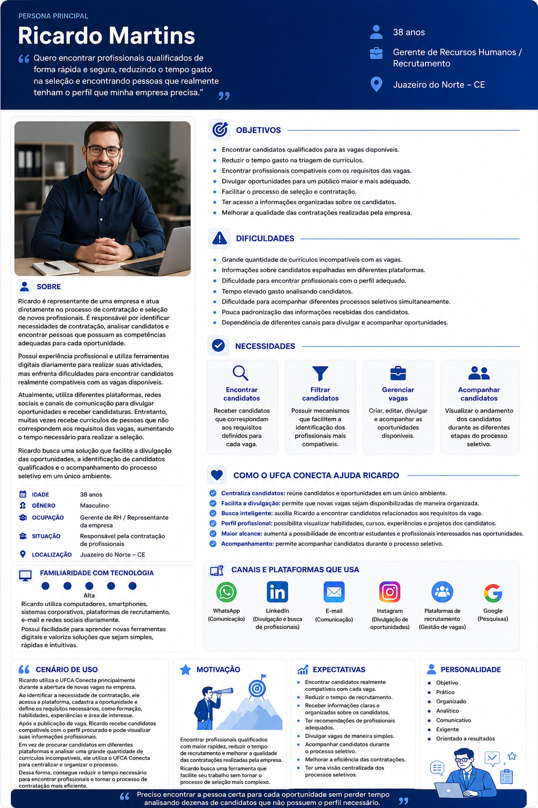
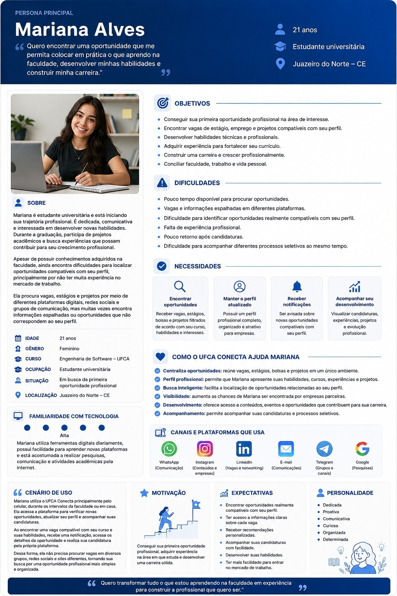
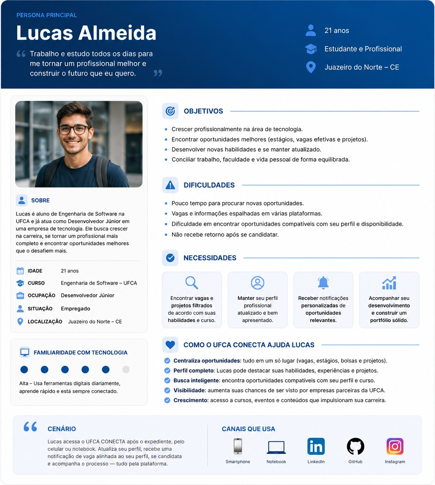

# Trabalho-pratico-IES
> **Projeto Prático - Introdução à Engenharia de Software:**
> Desenvolvendo a concepção inicial de um sistema de empregabilidade próprio para a Universidade Federal do Cariri - (UFCA), aplicando os conceitos trabalhados na disciplina em uma situação real.

## 📌 Sumário
 1. [Descrição do problema](#descrição)
 2. [Personas](#personas)
 3. [User Stories](#-user-stories)
 4. [Requisitos](#-requisitos)
 5. [Protótipos](#-protótipos)
 6. [Planejamento Inicial](#-planejamento-inicial)
 7. [Principais Dificuldades](#-principais-dificuldades)
 8. [Principais Aprendizados](#-principais-aprendizados)

---

# 📄Descrição

### Contexto:
Como forma de edificar cada vez mais a imagem da UFCA (Universidade Federal do Cariri), bem como de seus alunos, no mercado, o seguinte projeto se propõe a desenvolver uma **plataforma de empregabilidade** específica para o contexto da universidade. Permitindo uma maior **integração entre alunos e empresas**, onde ambos poderão exibir seus perfis profissionais, e onde as empresas poderão, além de também divulgar os próprios perfis, divulgar possíveis vagas a serem preenchidas por estes futuros profissionais.

### Justificativa:
Foi constatado que, mesmo que já existam plataformas de empregabilidade notórias, tais como LinkedIn e workana, **ainda é muito difícil inserir-se em um mercado** utilizando plataformas tão amplas (o LinkedIn é global). Algo que atinge principalmente universitários em formação, seja pela falta de oportunidades direcionadas ou pela dificuldade em situar-se em contextos muito amplos de competição. Além de que muitas **oportunidades são direcionadas em plataformas distintas**, trazendo ainda mais dificuldades.

### Público alvo:
**Universitários da UFCA** e **quaisquer empresas, organizações ou instituições (públicas ou privadas)** interessadas em divulgar vagas e oportunidades na plataforma, além de seus perfis profissionais.

### Escopo do problema:
Contexto da Universidade Federal do Cariri - UFCA.

### Impacto esperado da solução:
Alavancar a imagem da UFCA no mercado, ao mesmo tempo em que ampara o aumento das possibilidades de emprego para alunos da instituição. Através de uma plataforma que conecta empresas com vagas abertas a futuros profissionais engajados.

---
# 👥Personas

## 💼 Persona 1: Contratante 

  

### Informações da Persona

O Ricardo Martins tem 38 anos e trabalha como Gerente de Recursos Humanos e Recrutamento. Ele busca encontrar candidatos qualificados para as vagas disponíveis, reduzir o tempo gasto na análise de currículos e tornar os processos de seleção e contratação mais rápidos e organizados.

Pensando nas dificuldades que ele enfrenta para encontrar profissionais com o perfil adequado, organizar informações de candidatos e acompanhar diferentes processos seletivos, o **UFCA CONECTA** pode ajudá-lo de várias formas. Por meio da plataforma, Ricardo pode criar e divulgar vagas, alcançar candidatos compatíveis com os requisitos definidos e visualizar suas informações de maneira organizada. Além disso, pode filtrar candidatos e acompanhar o andamento de cada processo seletivo em um único ambiente.

Dessa forma, o **UFCA CONECTA** ajuda o Ricardo a otimizar o recrutamento, reduzir o tempo gasto na seleção de candidatos e encontrar profissionais mais adequados às necessidades da empresa.

[Ver persona completa](Personas/persona-Ricardo.md)
---

## 🎓 Persona 2 — Aluno Desempregado

  

### Informações da Persona Mariana Alves

Estudante universitária, 21 anos, cursando Engenharia de Software na UFCA (Juazeiro do Norte – CE). Está em busca de sua primeira oportunidade profissional, mas enfrenta dificuldades como pouco tempo disponível, vagas espalhadas em várias plataformas e falta de experiência para se destacar nos processos seletivos.

O sistema atende diretamente às suas necessidades: centraliza oportunidades compatíveis com seu perfil, mantém seu currículo/perfil sempre atualizado, envia notificações relevantes e permite acompanhar sua evolução profissional em um único lugar.

[Ver persona completa](Personas/persona_Mariana.md)
---

## 🚀 Persona 3 — Aluno Empregado que Deseja Melhorar a Carreira

  

### Informações da Persona

O Lucas Almeida tem 21 anos, é estudante de Engenharia de Software e trabalha como Desenvolvedor Júnior. Ele busca crescer na área de tecnologia, encontrar novas oportunidades e desenvolver suas habilidades.

Pensando nas dificuldades que ele enfrenta para encontrar vagas e conciliar a faculdade com o trabalho, o UFCA CONECTA pode ajudá-lo de várias formas, reunindo vagas, estágios, bolsas e projetos em um só lugar, facilitando sua busca por oportunidades. Ele também pode criar um perfil completo, destacando suas habilidades e experiências, além de encontrar vagas compatíveis com seu curso e perfil.

Dessa forma, o UFCA CONECTA ajuda o Lucas a encontrar oportunidades, aumentar sua visibilidade e continuar crescendo profissionalmente.

[Ver persona completa](Personas/persona-lucas.md)
---

# 🪪 User Stories:
As user stories foram definidas com base em três tipos de usuários: Alunos da UFCA, Contratantes e Usuários Globais (cadastrados ou não cadastrados).

Ao todo foram descritas 17 user stories, identificadas dos IDs e separadas com base nos tipos de usuários a que se destinam.

Além disso foram utilizadas sessões de planning poker para definir as estimativas, bem como alinhar os critérios de aceitação e qualquer alteração necessária.

## [Ver lista completa](./UserStories.md)

# Requisitos
Os requisitos foram feitos tendo como base as user stories, foi formatado como uma lista que indica o ID único de cada um, juntamente com o seu conteúdo, prioridade e user storie que tem foi usada como base para o desenvolvimento dele.
Nesse arquivo se encontram 80 Requisitos, sendo 66 requisitos funcionais e 14 requisitos não funcionais.

[Ver todos os requisitos](./Requisitos)

# 📝 Protótipos 
Com o objetivo de expressar algumas das funcionalidades dejesadas através de esbolços de telas e funcionalidades, criamos protótipos de baixa, média e alta fidelidade.

## Protótipos de baixa fidelidade
Utilizando lápis e papel, buscamos expressar as funcionalidades básicas do sistema, o estilo compreendido e comportamentos esperados:

 Visualização das funcionalidades do site para computadores
  

  
  

 Visualização das funcionalidades do site para dispositvos móveis
  

  
  

=======
## Protótipos de média fidelidade
A partir dos protótipos de baixa fidelidade, desenvolvemos uma versão de média fidelidade das principais telas do sistema. Nesta etapa, buscamos representar com mais clareza a estrutura, organização dos elementos e funcionalidades da interface, utilizando componentes visuais mais definidos, porém sem o nível de detalhamento presente no protótipo de alta fidelidade.

 Visualização da página inicial
  

  
  

 Visualização do dashboard
  

  
  

 Visualização da tela de exploração de vagas
  

  
  

 Visualização do perfil de uma empresa
  

  
  

# 🚧 Dificuldades

Durante o desenvolvimento do projeto, uma das principais dificuldades que encontramos foi a gestão do tempo e a organização do grupo. Tivemos um período relativamente curto para desenvolver todas as etapas do trabalho, enquanto, ao mesmo tempo, estávamos envolvidos em várias outras atividades e trabalhos de diferentes disciplinas.

Além disso, tivemos dificuldades para conciliar os horários de todos os integrantes, o que acabou tornando mais complicado marcar reuniões e manter uma comunicação constante entre o grupo. Em alguns momentos, também não conseguimos organizar as tarefas da melhor forma, o que fez com que algumas atividades acabassem ficando acumuladas ou fossem realizadas com pouco tempo disponível.

# 📚 Aprendizados

Durante o desenvolvimento do projeto, aprendemos principalmente a importância da organização, do planejamento e da comunicação dentro de uma equipe. Percebemos que, mesmo com pouco tempo e várias atividades acontecendo ao mesmo tempo, é essencial dividir bem as responsabilidades e manter todos alinhados. Também aprendemos a nos adaptar aos imprevistos e a trabalhar em conjunto para encontrar soluções e cumprir os prazos. Essas experiências contribuíram para melhorar nossa forma de trabalhar em equipe e nos preparar melhor para futuros projetos.